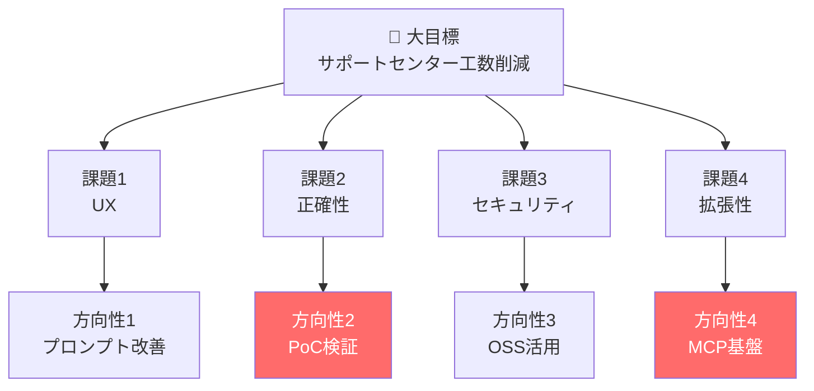
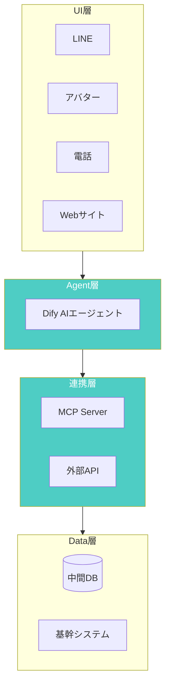
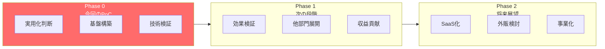
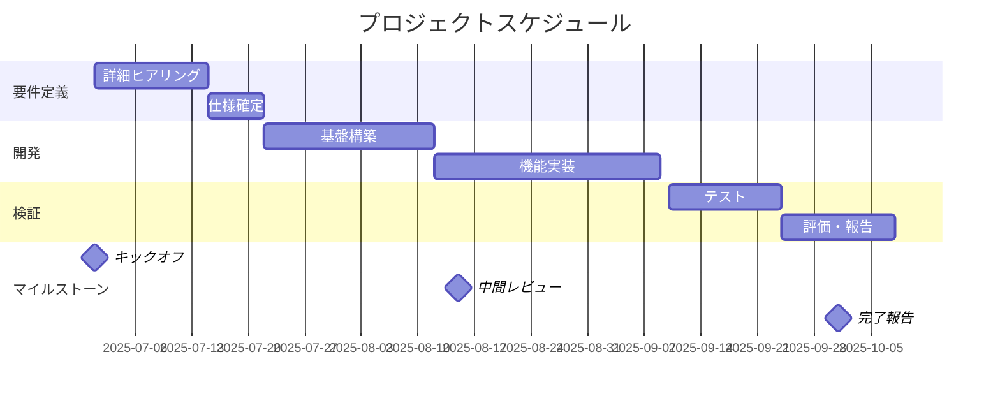
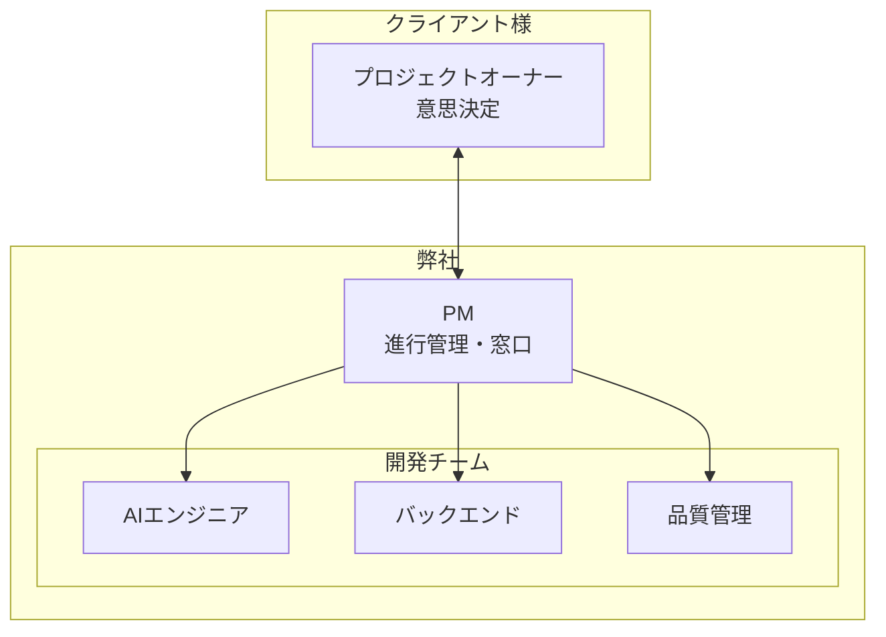
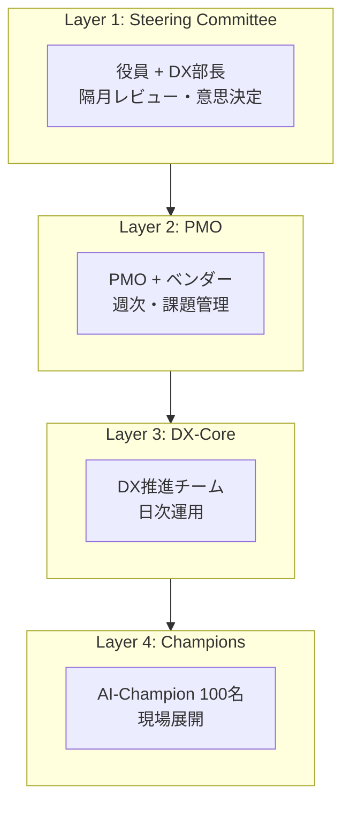
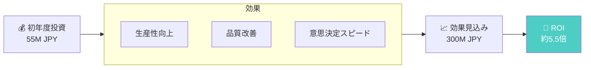
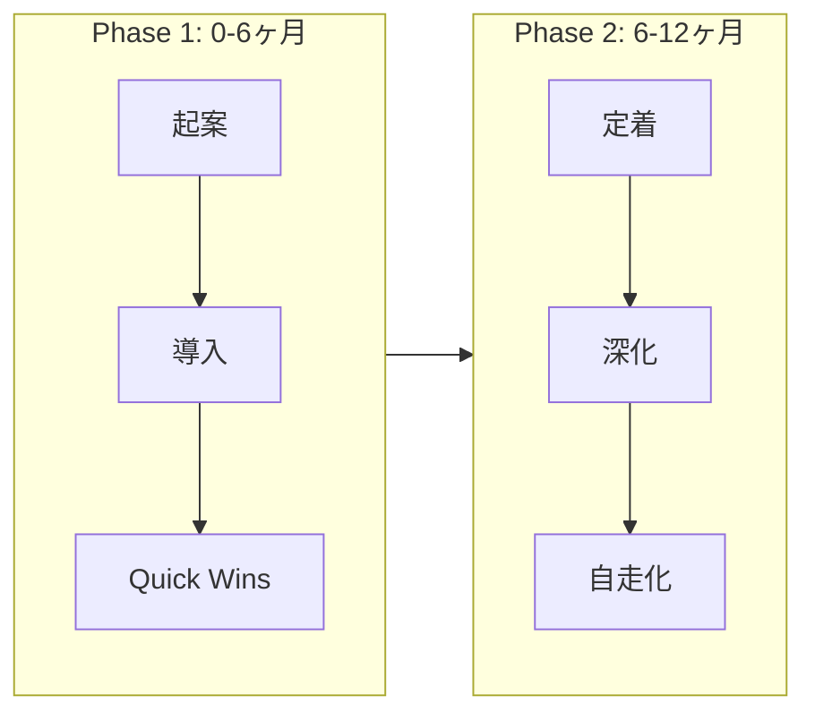
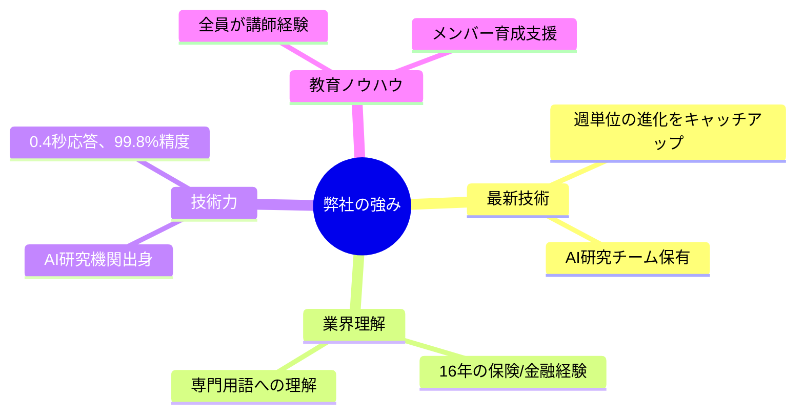
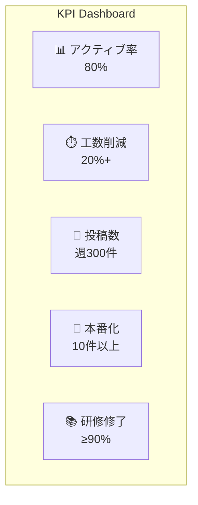

# Mermaid図解テンプレート

提案書仕様書で使用するMermaid図解のテンプレート集。

---

## 1. 課題構造図（逆ピラミッド）

ゴールから課題、解決策への逆算構造。

---

## 2. アーキテクチャ図（レイヤー構造）

システム構成を層で表現。

---

## 3. フェーズ展開図

時間軸での段階展開。

---

## 4. ガントチャート

プロジェクトスケジュール。

---

## 5. 体制図（組織構造）

プロジェクト体制。

---

## 6. ガバナンス構造（4層）

組織変革型の場合の意思決定構造。

---

## 7. ROI分析図

投資対効果の可視化。

---

## 8. 導入プロセス（ステップ）

組織変革型の導入フェーズ。

---

## 9. 強み比較表

差別化ポイントの可視化（表形式推奨だがMermaidでも可能）。

---

## 10. KPIダッシュボード

目標指標の可視化。

---

## 使用上の注意

1. **色の使い方**
   - `fill:#ff6b6b` - 強調（今回のスコープ、重要ポイント）
   - `fill:#4ecdc4` - ポジティブ（成果、効果）
   - デフォルト - 通常要素

2. **スタイルの統一**
   - 同一資料内では色・形状を統一
   - 日本語はダブルクォートで囲む

3. **複雑さの制御**
   - 1つの図に要素を詰め込みすぎない
   - 複雑な場合は複数の図に分割
