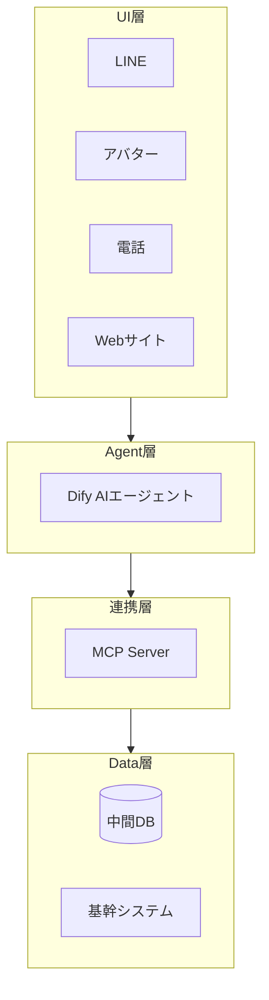
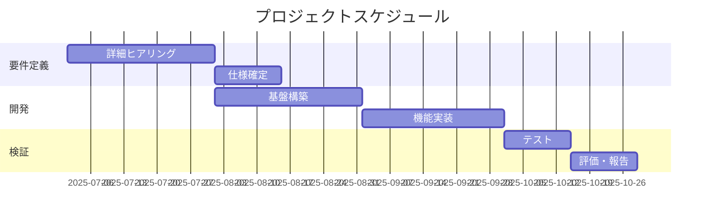
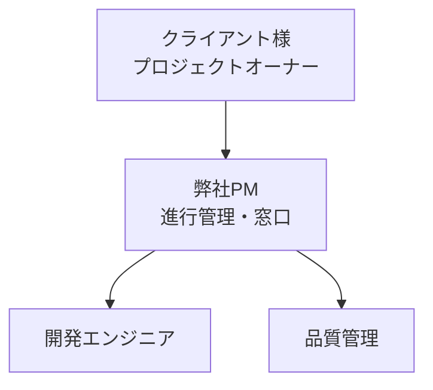

# スライド仕様詳細（見せ方・設計意図）

各スライドタイプの「見せ方」と「なぜそう見せるのか」を記述。仕様書作成時にこの設計思想を反映させる。

---

## 1. タイトルスライド

### 目的
第一印象で「この提案は自分のためのものだ」と感じさせる

### 見せ方
- **中央配置**：提出先企業名を最上位に大きく
- **階層構造**：提出先 > プロジェクト名 > サブタイトル > 提案者
- **余白**：情報を詰め込まず、高級感・信頼感を演出

### 仕様書での記述例
```markdown
## スライド1: タイトル

### 目的
提出先への敬意と、プロジェクトの位置づけを明示

### 見せ方
- 提出先企業名を最上位に配置（「〇〇様」形式）
- プロジェクト名を中央に大きく
- 日付・提案者は下部に控えめに

### コンテンツ
- 提出先：スミセイ情報システム様
- プロジェクト名：AIエージェント PoCプロジェクト
- サブタイトル：ご提案書
- 日付：2025年1月
- 提案者：株式会社Link AI

### 設計意図
「あなたのための提案」という専用感を演出。汎用テンプレートではなく、
この企業のためにカスタマイズされた資料であることを冒頭で示す。
```

---

## 2. 目次スライド

### 目的
全体像を俯瞰させ、「これから何が語られるか」の期待値を設定

### 見せ方
- **番号付きリスト**：順序と構造を明示
- **アイコン併用**：視認性向上、各セクションの性質を直感的に伝達
- **グルーピング**：関連セクションを視覚的にまとめる

### 仕様書での記述例
```markdown
## スライド2: 目次

### 目的
全体構成を提示し、聞き手の心理的準備を整える

### 見せ方
- 番号付きリストで10項目以内
- 各項目にアイコンを付与して視認性向上
- 「課題認識」「提案内容」「実行計画」「信頼性」の4ブロックに分類

### コンテンツ
1. 📋 前提・ご相談内容の整理
2. 💡 ご提案の全体像
3. 📅 プロジェクト計画
4. 👥 体制・進め方
5. ⭐ 弊社の強み
6. 💰 お見積もり
7. 🚀 今後の展開
8. 📂 開発実績
9. 🏢 会社概要

### 設計意図
目次は「地図」。聞き手は今どこにいて、次に何が来るかを把握できる。
これにより安心感と集中力が生まれる。
```

---

## 3. 与件整理・課題整理スライド ★重要

### 目的
「私たちはあなたの課題を深く理解している」を証明

### 見せ方：逆ピラミッド構造（ゴールからの逆算）

```
        ┌─────────────────────┐
        │      大目標         │  ← 最上位：クライアントの最終ゴール
        │ （サポートセンター  │
        │   工数削減）        │
        └─────────┬───────────┘
                  │
    ┌─────────────┼─────────────┐
    ▼             ▼             ▼
┌───────┐   ┌───────┐   ┌───────┐
│課題1  │   │課題2  │   │課題3  │  ← 中間層：ゴール達成を阻む課題
│ UX    │   │正確性 │   │拡張性 │
└───┬───┘   └───┬───┘   └───┬───┘
    │           │           │
    ▼           ▼           ▼
┌───────┐   ┌───────┐   ┌───────┐
│方向性1│   │方向性2│   │方向性3│  ← 最下層：今回の提案（解決の方向性）
│プロンプ│   │PoC検証│   │MCP基盤│
│ト改善 │   │       │   │       │
└───────┘   └───────┘   └───────┘
```

### 設計意図
- **トップダウン思考**：ゴールから逆算することで「なぜこの提案なのか」の必然性を示す
- **因果関係の可視化**：課題と解決策の対応関係を縦に揃える
- **スコープの明確化**：赤枠等で「今回の提案範囲」を強調（全部やるわけではない）

### 仕様書での記述例
```markdown
## スライド3: ご相談内容の整理

### 目的
クライアントの課題を「代弁」し、理解の深さを証明

### 見せ方
**逆ピラミッド構造（ゴールからの逆算）**
- 最上位：大目標（クライアントの最終ゴール）
- 中間層：大目標達成を阻む課題（3〜4個）
- 最下層：各課題に対する解決の方向性（今回の提案）
- 強調：今回のスコープを赤枠で囲み、「核心技術」と「容易に改善可能な部分」を分離

### コンテンツ

**大目標**
> サポートセンター業務の工数削減

**課題と方向性**

| 課題 | 方向性 | 今回のスコープ |
|------|--------|--------------|
| UX（使いやすさ） | プロンプト/リッチメニュー改善 | - |
| 正確性 | PoCにて精度向上を検証 | ★核心 |
| セキュリティ | Dify等OSSをAzure/オンプレ運用 | - |
| 拡張性 | MCP Server基盤構築、メンバー育成 | ★核心 |

### 設計意図
「前回のMTGを踏まえ、本プロジェクトの全体像を以下のように捉えております」
という導入で、クライアントとの対話履歴を明示。
ゴールから逆算した構造で「なぜこの提案なのか」の論理的必然性を示す。
```

---

## 4. 提案の全体像スライド

### 目的
「私たちのソリューション」の全体像を一目で把握させる

### 見せ方：レイヤー構造（アーキテクチャ図）

```
┌─────────────────────────────────────────┐
│  UI層：LINE / アバター / 電話 / Web    │
├─────────────────────────────────────────┤
│  Agent層：Dify / AIエージェント         │
├─────────────────────────────────────────┤
│  連携層：MCP Server / API              │
├─────────────────────────────────────────┤
│  Data層：中間DB / 基幹システム          │
└─────────────────────────────────────────┘
```

### 設計意図
- **層構造**：技術スタックを整理し、各層の役割を明確化
- **拡張ポイント**：将来追加できるチャネル（電話、メール等）を示唆
- **今回のスコープ**：どの層を今回構築するかを色分け

### Mermaidでの表現


---

## 5. フェーズ構成スライド

### 目的
「今回の提案は通過点であり、将来への布石である」を示す

### 見せ方：時間軸での段階展開

```
Phase 0          Phase 1           Phase 2
今回のPoC    →   次の段階     →    将来展望
─────────────────────────────────────────────→ 時間軸

・実用化判断      ・効果検証        ・SaaS化
・基盤構築        ・他部門展開      ・外販検討
・技術検証        ・収益貢献        ・事業化
```

### 設計意図
- **継続性の示唆**：単発案件ではなく長期パートナーシップを想起させる
- **投資対効果の時間軸拡張**：PoCの先にある「本当のゴール」を提示
- **意思決定の促進**：「今始めないと将来の機会を逃す」

---

## 6. スケジュールスライド

### 目的
「いつ、誰が、何をするか」を具体的に示す

### 見せ方：ガントチャート形式

### Mermaidでの表現


### 設計意図
- **WBS形式**：タスクを階層化し、親子関係を明示
- **担当区分**：[共]共同、[S]クライアント様、[L]弊社を色分け
- **マイルストーン**：重要な意思決定ポイントを明示

---

## 7. 体制スライド

### 目的
「誰が責任を持つのか」を明確にし、安心感を与える

### 見せ方：組織図＋コミュニケーション計画

### Mermaidでの表現


### 設計意図
- **責任の明確化**：誰が意思決定し、誰が実行するか
- **One Team**：「私たちは一緒に作る」という協働姿勢
- **コミュニケーション計画**：週次定例、Slack、タスク管理ツール

---

## 8. 強みスライド

### 目的
「なぜ他社ではなく私たちなのか」を明示

### 見せ方：3〜5個のキーワード＋詳細

```
┌─────────┬─────────┬─────────┬─────────┐
│   ⚡    │   💬    │   🛡️    │   📚    │
│最新技術 │業界理解 │技術力   │教育     │
├─────────┼─────────┼─────────┼─────────┤
│週単位の │16年の   │AI研究   │全員が   │
│進化を   │業界経験 │機関出身 │講師経験 │
│キャッチ │         │         │         │
└─────────┴─────────┴─────────┴─────────┘
```

### 設計意図
- **差別化の明示**：競合との違いを端的に
- **掛け算の強調**：「技術力」×「業界知見」
- **数値での裏付け**：「16年」「年間30回」など具体的に

---

## 9. 見積もりスライド

### 目的
投資判断に必要な情報を過不足なく提示

### 見せ方：金額＋内訳＋条件

```
┌────────────────────────────────────┐
│       お見積もり金額（一式）       │
│                                    │
│      ¥3,100,000（税別）           │
│                                    │
├────────────────────────────────────┤
│ 【内訳】                          │
│ PM（統括）：150万円 × 1.0人月     │
│ Eng（開発）：120万円 × 1.5人月    │
├────────────────────────────────────┤
│ 【補足事項】                      │
│ ・クラウド利用料は別途実費        │
│ ・保守運用は別途ご相談            │
└────────────────────────────────────┘
```

### 設計意図
- **透明性**：内訳を明示して信頼を得る
- **条件明示**：後からの認識齟齬を防ぐ
- **ROI（組織変革型の場合）**：投資対効果を示す

---

## 10. 実績スライド

### 目的
「私たちは実績がある」を証明

### 見せ方：背景→ソリューション→成果の3カラム

| 背景・課題 | ソリューション | 成果 |
|-----------|---------------|------|
| ・課題1   | ・機能1       | ・工数1/5削減 |
| ・課題2   | ・機能2       | ・精度99.8% |

### 設計意図
- **類似性のアピール**：提案先と似た業界・課題の事例を選ぶ
- **定量的成果**：数値で効果を証明
- **第三者評価**：メディア掲載、受賞歴があれば付加

---

## 11. 会社概要スライド

### 目的
「私たちは信頼できる組織である」を示す

### 見せ方：基本情報＋代表者プロフィール

### 設計意図
- **実在性の証明**：所在地、設立年、連絡先
- **権威性**：代表者の経歴、実績
- **締めくくり**：最後に「誰と仕事をするか」を印象づける
